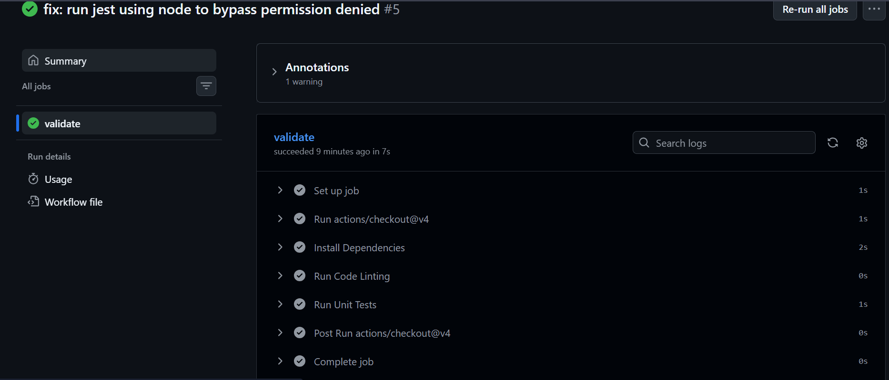
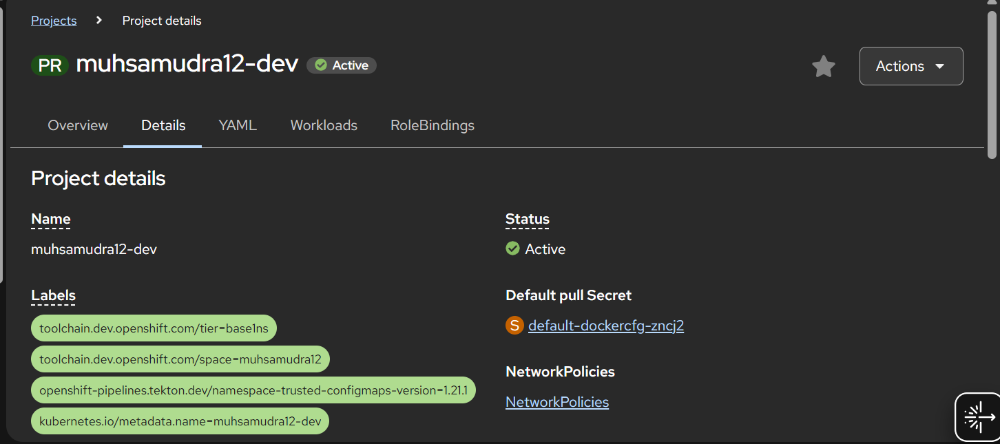
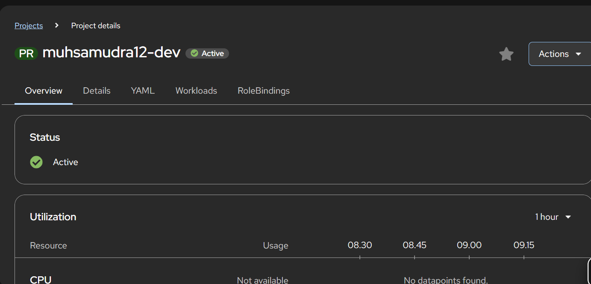
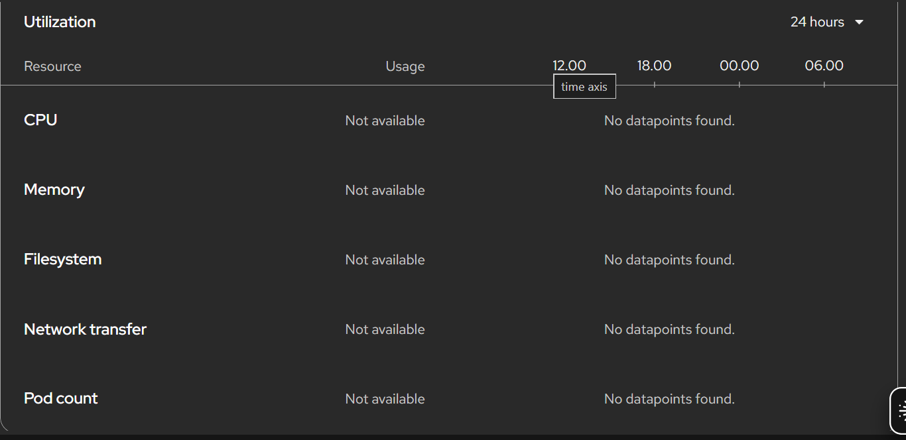

# Task Tracker CI/CD Project

A simple RESTful API for task management, built with **Node.js** and **Express**. This project is designed to demonstrate a complete **CI/CD pipeline** workflow using **GitHub Actions** for validation and **OpenShift (Tekton)** for deployment.

## Features

- **Task Management:** Fetch and list tasks via API.
- **Automated Testing:** Unit tests implemented with **Jest**.
- **Linting:** Code quality checks using **ESLint**.
- **CI/CD Ready:** Integrated with GitHub Actions and Tekton pipelines.

## Project Structure

```text
.
├── .github/workflows/   # CI Pipeline configuration (Tasks 2 & 3)
├── .tekton/             # Tekton task definitions (Tasks 4 & 5)
├── src/                 # Application source code
├── tests/               # Unit testing files
└── package.json         # Project dependencies and scripts
```

## Setup & Installation
Clone the repository:
git clone https://github.com/muhsamudra12/devlink-cicd-project.git
cd devlink-cicd-project

## Install dependencies:
npm install

## Run Tests:
npm test

## Run Linting:
npm run lint

## Pipeline Execution Results
Below are the successful execution logs and configurations as required by the final project submission.

### Task 7: GitHub Actions Status
**Filename:** `screenshots/cicd-github-validate.png`


### Task 8: OpenShift Pipeline Details
**Filename:** `screenshots/oc-pipelines-oc-final.png`


### Task 9: OpenShift Pipeline Success
**Filename:** `screenshots/oc-pipelines-oc-green.png`


### Task 10: Running Application Logs
**Filename:** `screenshots/oc-pipelines-app-logs.png`

